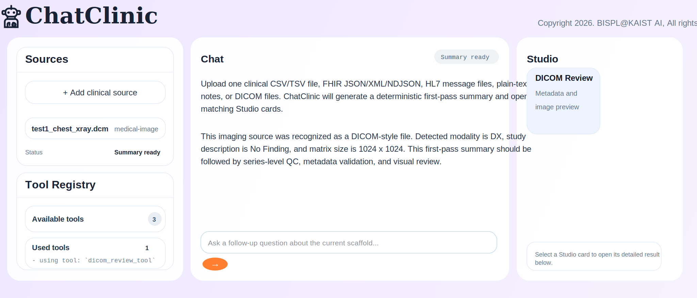
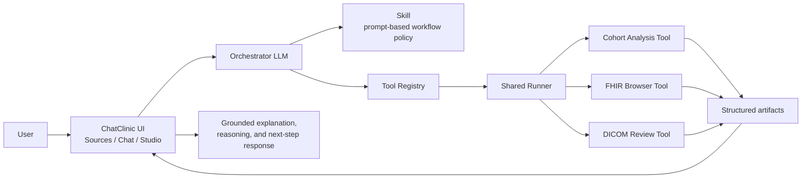

# ChatClinic

Clinical data and medical imaging analysis workspace for teaching and building **Agentic AI**.



## Why this project exists

`ChatClinic` is designed for a class in which students learn how to build an AI system that can accept **clinical data** and **medical images**, then perform:

- integrated analysis
- diagnosis support
- multimodal reasoning
- structured review
- prediction-oriented downstream workflows

The central educational goal is not merely to build a chatbot. It is to show students how to build an **Agentic AI system** that can coordinate multiple specialized tools under the guidance of an orchestrating LLM.

In this project, the AI may receive:

- clinical tables such as CSV, TSV, and Excel eCRF files
- FHIR JSON/XML/NDJSON
- HL7 message files
- plain-text clinical notes
- DICOM medical imaging files

and combine them into a single, grounded workflow.

## Educational perspective: what students should learn

This repository is written for **beginner students** who are learning what Agentic AI actually means in practice.

The key lesson is:

- an LLM should not do every calculation itself
- the LLM should decide **what to do next**
- deterministic tools should perform the actual analysis
- the system should keep results as structured artifacts
- the UI should make the reasoning trace visible

This lets students see that a modern AI system is not just:

- `user -> chatbot -> answer`

but rather:

- `user -> orchestrator -> tools -> artifacts -> grounded answer`

That is the practical teaching value of Agentic AI in this course.

## The main idea: orchestrator LLM + Skill + tools

`ChatClinic` separates the system into three educational layers:

1. **Orchestrator LLM**
   - reads the current request and context
   - decides whether a tool is needed
   - explains results after tools finish

2. **Skill**
   - stores the orchestration prompt and policy in `SKILL.md`
   - describes when tools should be used
   - controls tool ordering, approval rules, and answer style

3. **Tool Registry**
   - contains the available analysis tools
   - lets the orchestrator choose among them
   - makes the system easy to extend with new student-built tools

This design is intentionally educational: students can change the behavior of the agent by editing a **Skill** rather than hunting through backend logic only.

## Why Skill-based orchestration is important

One of the most important concepts in this class is that the logic for calling tools is not hidden entirely inside backend code.

Instead, the orchestration rule can live in a readable prompt file:

- which tool should be preferred
- when approval should be requested
- what order tools should run in
- how the LLM should explain results

This has a major teaching advantage:

- instructors can easily change the workflow
- students can understand the current orchestration policy
- the behavior of the system can be discussed as part of prompt design
- new tools can be added without rewriting the whole application

In short:

- `Skill` = the instructions that guide the orchestrator LLM
- `Tool` = the deterministic function that actually performs the analysis

## High-level diagram



## Why this is a good classroom architecture

For teaching, this architecture is simpler and more powerful than asking each student team to build a separate full application.

The recommended model is:

- the instructor operates one shared `ChatClinic`
- the instructor maintains the orchestration `Skill`
- each student team submits one or more tool plugins
- the shared runner executes those tools
- the UI shows the resulting artifacts in `Studio`

This helps students focus on what matters:

- building a useful analysis tool
- defining its inputs and outputs clearly
- understanding how an orchestrator LLM chooses and uses tools

## What makes this Agentic AI

This project is an Agentic AI system because the LLM is used as an **orchestrator**, not merely a text generator.

It can:

1. inspect uploaded data and user intent
2. decide whether a tool is needed
3. follow the policy written in a `SKILL.md` file
4. choose the appropriate tool from the registry
5. execute the tool through the shared runner
6. receive structured outputs
7. produce a grounded answer based on the resulting artifacts

This is exactly the kind of system architecture students should understand if they want to build reliable multimodal AI systems for healthcare.

## What students can build in this class

Student teams can contribute tools such as:

- cohort analysis
- FHIR patient browsing
- DICOM review
- QC and harmonization tools
- segmentation
- detection
- structured reporting
- prediction and triage tools

As long as a tool follows the plugin contract, it can be registered and orchestrated by `ChatClinic`.

## Read first

If you are teaching this system or adding a new classroom tool, read these first:

- [Course tool contract](docs/COURSE_TOOLS.md)
- [Tool plugin guide](docs/TOOL_PLUGIN_GUIDE.md)

These documents explain:

- how students should submit tools
- what `tool.json` should contain
- how `run.py` should behave
- when the orchestration Skill should also be updated

## Core project pieces

- `skills/chatclinic-orchestrator/SKILL.md`
  - orchestration prompt and policy for the LLM
- `plugins/`
  - registered tools
- `app/services/tool_runner.py`
  - shared runner that executes tools
- `app/services/skill_orchestrator.py`
  - Skill-guided routing helpers
- `webapp/app/page.tsx`
  - UI for Sources, Chat, Studio, and review panels

## Example tools in this repository

Current example tools include:

- `plugins/cohort_sheet_browser/`
- `plugins/fhir_browser_tool/`
- `plugins/dicom_review_tool/`

Together they demonstrate how one agentic system can support:

- cohort-oriented structured data analysis
- patient-centered clinical browsing
- medical image review

under one orchestration layer.

## Example data

The `examples/` folder includes demo files such as:

- cohort Excel sheets
- FHIR JSON/XML and bulk NDJSON
- HL7 messages
- chest X-ray and DICOM examples

These are intended for both classroom demonstration and student tool development.

## Quick start

```bash
cd /Users/jongcye/Documents/Codex/workspace/clinical_multimodal_workspace
cp .env.example .env
```

Then set:

```bash
OPENAI_API_KEY=sk-...
OPENAI_WORKFLOW_MODEL=gpt-5-nano
OPENAI_MODEL=gpt-5-mini
```

## Summary

`ChatClinic` is a teaching-oriented multimodal clinical Agentic AI workspace.

Its educational message is simple:

- the LLM should orchestrate
- the Skill should describe the orchestration policy
- the tools should perform the actual analysis
- the UI should expose the artifacts clearly

That separation makes the system easier to teach, easier to extend, and much better suited for project-based learning in medical AI.
